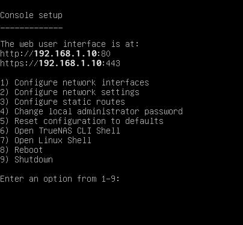
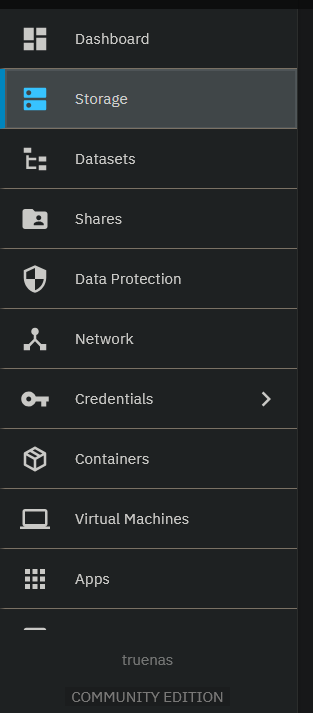
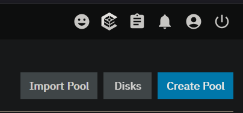

# TrueNAS Setup Guide

> **NOTE:** The procedure described below will **wipe all involved
> drives** during installation. Proceed with caution.

## Requirements

-   **USB boot drive** (Ventoy recommended, but any tool works)
-   **Computer/Server** to install TrueNAS SCALE on
    -   Must have **at least two drives**:
        -   One internal boot drive
        -   One secondary drive for storage
-   **Stable internet connection** and **router with admin access**

## Initial Setup

1.  Download TrueNAS:

    -   Navigate to:\
        **https://www.truenas.com/download-truenas-community-edition/**\
        Download the latest version of **TrueNAS SCALE** (may now appear
        as *TrueNAS Community Edition*).

2.  Create a bootable USB drive:

    -   Download the `.iso` and copy it to your USB boot drive.

3.  Install TrueNAS:

    -   Power down the target system.
    -   Insert the USB boot drive.
    -   Boot from USB and follow installation prompts.
    -   Install the OS on your **internal boot drive**.

4.  After installation, you should see the console setup menu.\

5.  From another device on the same network, open the URL displayed on
    the TrueNAS console screen.

6.  Create your web UI **username and password**.

## Dataset Creation

A **dataset** is a filesystem-like container within a **storage pool**.
Think of it as a folder with additional features such as quotas and
snapshots.

### Create a Storage Pool

1.  Go to **Storage** in the left sidebar.\

2.  Click **Create Pool**.\

3.  Name your pool (e.g., `Main`).
4.  Select a layout:
    -   With **one drive**, choose **Stripe** (no redundancy).
    -   For redundancy, choose **Mirror** (requires two drives).
5.  Review and click **Create Pool**.

<!--# Creating a Dataset and SMB Share in TrueNAS SCALE
-->
### Create a Dataset

Once your storage pool exists, you can create datasets inside it.

1. Open the **Datasets** section from the sidebar. You should see your pool listed there.
2. Select the pool, then click **Add Dataset** in the top-right corner of the window that appears.
3. Give the dataset a name and save your changes.

Now that we have a dataset, we want to make it accessible from other devices on our network. To do this, we will create an SMB share.

---

### SMB Shares

**Server Message Block (SMB)** is a network protocol that enables devices to share resources such as files and folders.  
In this case, our dataset will become the resource shared through SMB.

> **Side Note:** SMB allows a Windows or macOS client to interact with TrueNAS’s ZFS filesystem by translating file operations into something the client understands (e.g., NTFS on Windows).

---

### Create an SMB User

Before creating the share, we need a **local user** who will be allowed to access it.  
You *cannot* use the TrueNAS admin account to access SMB shares.

1. Navigate to **Credentials → Users** in the sidebar.
2. Click **Add** to create a new user.
3. Enter a username and password.  
4. Enable the **SMB User** checkbox.  
   (Other fields can be left at their defaults unless you know you need to modify them.)
5. Save the user.

Now that we have an SMB user, we can create the SMB share.

---

### Create an SMB Share

1. Go to **Shares** in the sidebar.
2. In the **Windows (SMB) Shares** section, click **Add**.
3. Select or enter the path to your dataset  
   (e.g., `/mnt/POOL_NAME/DATASET_NAME`).  
   You can use the GUI path picker if you prefer.
4. Give the share a name.
5. Save your changes.

---

### Accessing the SMB Share from Another Device

Now that we have a dataset, an SMB share, and an SMB user, we can access the share from any device on the network.

The process is similar across platforms; the following example uses Windows.

1. On a Windows computer, open **File Explorer**.
2. In the left sidebar, scroll to **Network** and locate your TrueNAS server  
   (it may appear as **TRUENAS**).
3. When prompted, enter your **SMB user** credentials.
4. You should now see your dataset displayed like a normal folder.
5. You can access, create, or modify files stored in the dataset.

---

### Your SMB share is now ready to use across your network!